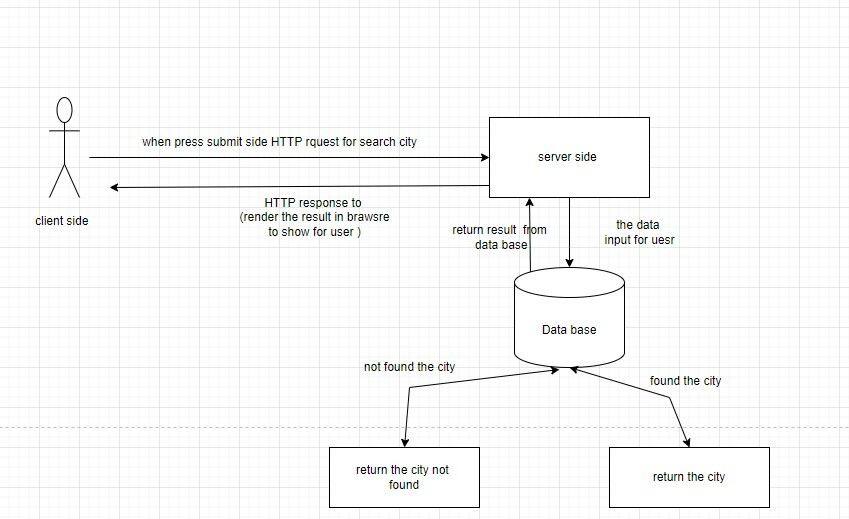

# Project Name

**Author**: Zaid Alshibi
**Version**: 1.1.0

## Overview

- building a project that uses LocationIQ API to explore the cities by their name which display a card containing the city image, lat, lon and title

## Getting Started

- initialize the project with create-react-app, axios, bootstrap and dotenv libraries
- create the form to have the user data
- send a request to the API to have the required city data
- create the card component to render the city's information
- have an error massege if the user entered a wrong city name

## Architecture

- React.JS

- Bootstrap

- Dotenv

- Axios

- LocationIQ API

## Change Log

01-08-2022 1:40pm - Application now has a fully-functional front-end with a form for user data and the data flow of the API

## Credit and Collaborations

